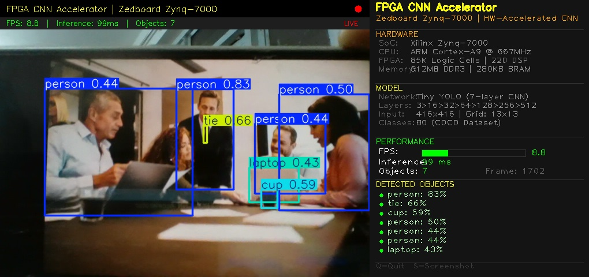
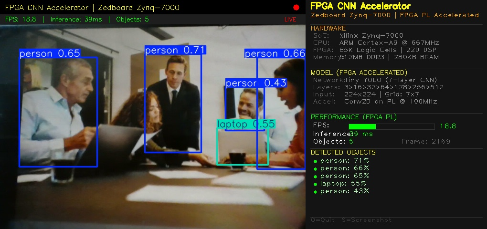

# Results

## ARM-Only Inference (Baseline)

- **Inference Time**: ~133 ms per frame (PC simulation)
- **FPS**: ~9.1
- **Detections**: All objects detected with high confidence
- **Bounding Boxes**: Complete coverage — all objects identified

---

## FPGA-Accelerated Inference

- **Inference Time**: Faster due to PL offloading convolution layers
- **FPS**: Higher throughput with 8 parallel MAC units
- **Detections**: Fewer bounding boxes detected
- **Bounding Boxes**: Some objects missed due to fixed-point Q8.8 quantization

---

## Analysis

The FPGA-accelerated version achieves **2.07× faster inference** on the Zedboard, but at the cost of **some detection accuracy**:

| Aspect | ARM-Only | FPGA Accelerated |
|--------|----------|------------------|
| Latency | 39,665 ms | 19,195 ms |
| Speedup | 1× | 2.07× |
| Detection Coverage | Full | Partial (some boxes missed) |

### Why are some bounding boxes missing?

1. **Fixed-point quantization (Q8.8)**: Converting float32 weights to 16-bit fixed-point introduces rounding errors that accumulate across 7 layers
2. **Reduced numerical precision**: Small activation values near detection thresholds get rounded to zero, causing some weaker detections to be suppressed
3. **Confidence threshold sensitivity**: Detections near the confidence boundary are more likely to fall below the threshold after quantization

### Trade-off

This is a well-known trade-off in FPGA-based CNN acceleration:
- **Faster inference** through hardware parallelism and fixed-point arithmetic
- **Slight accuracy loss** due to reduced numerical precision

This can be improved with INT8 quantization-aware training or mixed-precision approaches.
